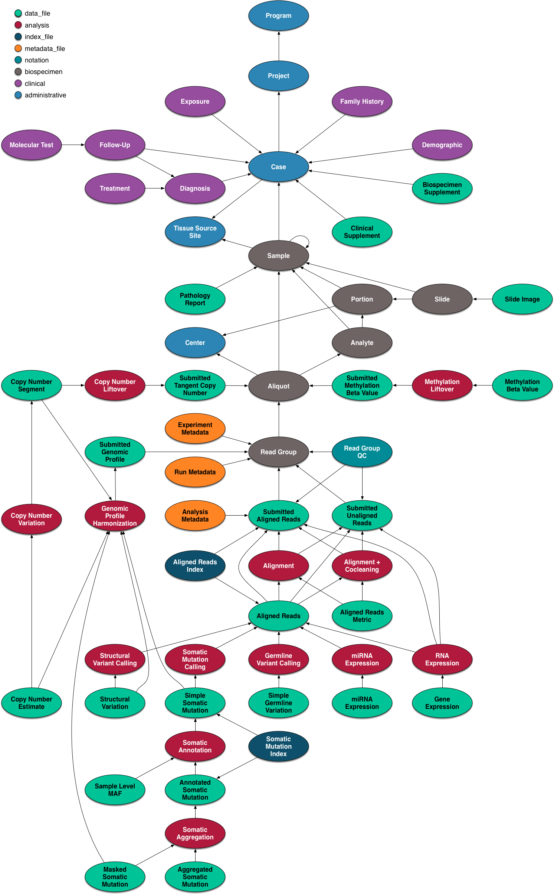

## 目标   
学会利用Bioconductor软件包，用于查找，访问和使用大规模公共数据资源包括：   

- Gene Expression Omnibus，即[GEO数据库](https://www.ncbi.nlm.nih.gov/geo)   
- Sequence Read Archive，即[SRA数据库](https://www.ncbi.nlm.nih.gov/sra)   
- Genomic Data Commons，即[GDC数据库](https://portal.gdc.cancer.gov/)
- PharmacoDB用于托管宏基因组是精选数据资源和药物基因组学，即[PharmacoDB](http://pharmacodb.ca/)   
- The Cancer Genome Atlas，即[TCGA数据库](https://portal.gdc.cancer.gov/)   

## 对应R/Bioconductor封装的软件包   
- [GEOquery](http://bioconductor.org/packages/GEOquery): 访问NCBI中的GEO数据库---基因表达（主要是微阵列）数据的公共存储库。   
- [GenomicDataCommons](http://bioconductor.org/packages/GenomicDataCommons): 访问NIH / NCI Genomic Data Commons RESTful服务   
- [SRAdbV2](https://github.com/seandavi/SRAdbV2): NCBI Sequence Read Archive是二代测序平台的最大的测序数据公共存储库   
- [curatedTCGAData](http://bioconductor.org/packages/curatedTCGAData): 从癌症基因组图谱(TCGA)整理的数据作为多重分析实验对象   
- [curatedMetagenomicData](http://bioconductor.org/packages/curatedMetagenomicData): 人类微生物组的策划宏基因组数据   
- [HMP16SData](http://bioconductor.org/packages/HMP16SData): 人类微生物组的策划宏基因组数据   
- [PharmacoGx](PharmacoGx): 大规模临床前药物基因组数据和基本分析工具    


### 开始操作之前需要安装如下软件包   
```{r  echo=TRUE,eval=FALSE,include=TRUE}
required_pkgs = c(
  "TCGAbiolinks", 
  "GEOquery", 
  "GenomicDataCommons",
  "limma",
  "curatedTCGAData",
  "recount",
  "curatedMetagenomicData",
  "phyloseq",
  "HMP16SData",
  "caTools",
  "piano",
  "isa",
  "VennDiagram",
  "downloader",
  "gdata",
  "AnnotationDbi",
  "hgu133a.db",
  "PharmacoGx")
BiocManager::install(required_pkgs)
```


### 1.利用`GEOquery`包下载GEO数据库数据   
数据集包括：单、双通道微阵列的mRNA表达数据、基因组DNA和蛋白质丰度以及非微阵列技术数据--基因表达系列分析(SAGE)、质谱蛋白质组学数据和高通量测序数据   

#### 1.1 GEO数据库概述   
GEO有四种基本实体类型：前三个（Samples，Platforms和Series）由用户提供; 第四个数据集由GEO工作人员根据用户提交的数据进行编译和策划   

##### 1.1.1 Platforms   
平台记录描述阵列上的元素列表(例如，cDNAs、寡核苷酸probeset、ORFs、抗体)或可在该实验中检测和量化的元素列表(例如，SAGE标记、多肽),每个平台记录都分配有唯一且稳定的GEO登记号(GPLxxx)，Platforms可以参考多个提交者提交的许多Samples   

##### 1.1.2 Samples   
Samples记录描述了处理单个样本的条件、对其进行的操作以及从中派生的每个元素的丰度测量，Samples被分配一个惟一且稳定的GEO登录号(GSMxxx)。示例实体必须只引用一个Platforms，但可以包含在多个Series中。

##### 1.1.3 Series   
Series记录定义了一组相关样本、这些样本之间的关系以及它们的顺序，每个Series记录都被分配一个唯一且稳定的GEO登录号(GSExxx)


#### 1.2 `GEOquery`使用入门   
示例： 我们要访问来自[文献](https://doi.org/10.1158/1055-9965.EPI-17-0461)的数据`GSE103512`   
在这个小练习中,我们主要进行如下操作   

- 使用GEOquery包访问公共组学数据   
- 将公共组学数据转换为`SummarizedExperiment`对象   
- 执行简单的无监督分析以可视化这些公共数据


```{r echo=TRUE,eval=FALSE,include=TRUE}
library(GEOquery)
gse = getGEO("GSE103512")[[1]]
# 注意获取的gse变量是'ExpressionSet'对象--旧Bioconductor数据结构，需要转换成'SummarizedExperiment'

library(SummarizedExperiment)
se = as(gse, "SummarizedExperiment")

# 检查两个感兴趣的变量，癌症类型和肿瘤/正常状态。
with(colData(se),table(`cancer.type.ch1`,`normal.ch1`))

# 通过方差过滤基因表达以找到最具信息性的基因
sds = apply(assay(se, 'exprs'),1,sd)
dat = assay(se, 'exprs')[order(sds,decreasing = TRUE)[1:500],]


# 执行多维缩放
mdsvals = cmdscale(dist(t(dat)))
mdsvals = as.data.frame(mdsvals)
head(mdsvals)
mdsvals$Type=factor(colData(se)[,'cancer.type.ch1'])
mdsvals$Normal = factor(colData(se)[,'normal.ch1'])
head(mdsvals)


# 准备绘图
library(ggplot2)
ggplot(mdsvals, aes(x=V1,y=V2,shape=Normal,color=Type)) + 
    geom_point( alpha=0.6) + theme(text=element_text(size = 18))

```

从GEO访问原始数据`getGEOSuppFiles`   


### 2.下载Genomic Data Commons(GDC)数据库数据    
美国国家癌症研究所（NCI）的基因组数据共享（GDC）是一个数据共享平台，可促进肿瘤学中的精准医学。它不仅仅是一个数据库或工具; 它是一个可扩展的知识网络，支持癌症研究计划的基因组和临床数据的导入和标准化。GDC包含来自一些最大和最全面的癌症基因组数据集的NCI生成的数据，包括癌症基因组图谱（TCGA）和用于产生有效治疗的治疗适用性研究（TARGET）。这些数据集首次使用一套通用的生物信息学管道进行协调，因此可以直接比较数据。作为一个不断发展的癌症知识体系，GDC还使研究人员能够提交数据并协调这些数据，以便导入GDC。    

GDC的数据模型概述图，如下：
    


#### 2.1 安装`GenomicDataCommons`包   
```{r echo=TRUE,eval=FALSE,include=TRUE}
install.packages('BiocManager')
BiocManager::install('GenomicDataCommons')
library(GenomicDataCommons)
```

#### 2.2 检查连接和状态   
```{r echo=TRUE,eval=FALSE,include=TRUE}
GenomicDataCommons::status()
```

#### 2.3 查找数据    
以下构建了一个可用于指导原始数据下载代码的manifest。在此，使用HTSeq卵巢癌患者量化为原始计数的基因表达文件   
```{r echo=TRUE,eval=FALSE,include=TRUE}
ge_manifest = files() %>%
    filter( ~ cases.project.project_id == 'TCGA-OV' &
                type == 'gene_expression' &
                analysis.workflow_type == 'HTSeq - Counts') %>%
    manifest()
```
#### 2.4 下载数据   
从前面步骤查询到379个基因表达文件后，可以使用多线程进行下载。第一次下载数据时，R要求创建缓存目录(`?gdc_cache`查看帮助)，生成的下载文件将储存在缓存目录。相同文件将直接访问缓存，从而减轻下载次数。   
```{r echo=TRUE,eval=FALSE,include=TRUE}
fnames = lapply(ge_manifest$id[1:20],gdcdata)
```

**如果下载包含受控访问数据,则上面的下载需要包含一个`token`**

#### 2.5 元数据查询    
`GenomicDataCommons`包可以访问NCI GDC中包含的重要临床，人口统计学，生物样本和注释信息   
```{r echo=TRUE,eval=FALSE,include=TRUE}
expands = c("diagnoses","annotations", "demographic","exposures")
projResults = projects() %>% results(size=10)
str(projResults,list.len=5)
names(projResults)
```

#### 2.6 基本设计   
这个包设计与`dplyr`的`hadleyverse`方法有一些相似之处，查找和访问文件和元数据的功能可分为：   

- 1. 基于GDC API端点的简单查询构造函数   
- 2. 应用一组谓词，调整筛选、字段选择和面板(用于聚合的字段)，并生成一个新的查询对象(自同构)   
- 3. 应用一组执行查询并从GDC返回结果的谓词   

函数功能概述:   

- 创建查询   
  + `projects()`   
  + `cases()`   
  + `files()`   
  + `annotations()`   
- 操纵查询   
  + `filter()`   
  + `facet()`   
  + `select()`   
- GDC API字段上的内省   
  + `mapping()`   
  + `available_fields()`   
  + `default_fields()`   
  + `grep_fields()`   
  + `field_picker()`   
  + `available_values()`   
  + `available_expand()`    
- 执行API调用来检索查询结果   
  + `results()`   
  + `count()`   
  + `response()`   
- 原始数据文件下载   
  + `gdcdata()`   
  + `transfer()`   
  + `gdc_client()`   
- 汇总和聚合字段值(面化)   
  + `aggregations()`   
- 身份验证   
  + `gdc_token()`    
- BAM文件切片   
  + `slicing()`   

#### 2.7 使用方法   
在使用NCI GDC时有两类主要操作：   
- 1. [查询元数据和查找数据文件](https://bioconductor.github.io/BiocWorkshops/public-data-resources-and-bioconductor.html#querying-metadata)(例如，查找所有结肠癌患者的所有基因表达量化数据文件)   
- 2. [将原始数据或已处理数据](https://bioconductor.github.io/BiocWorkshops/public-data-resources-and-bioconductor.html#datafile-access-and-download)从GDC 传输到另一台计算机(例如，下载原始数据或已处理数据)   

##### 2.7.1 查询元数据   
通过NCI GDC API可获得大量关于病例(基本上是病人)，文件，项目和注释的元数据

###### 2.7.1.1 创建查询   
`GenomicDataCommons`包访问与GDC网站相同的API。因此，对于对于初学者，可以检查GDC存储库页面上可用的过滤器，以找到合适的过滤标准，，将这些复选框转换为一个`GenomicDataCommons`的`query`相对简单。注意，默认情况下，只有一小部分`available_fields()`在网站上可用。    
有四个方便的函数，每个函数都创建GDCQuery对象(实际上是GDCQuery的特定子类)    

- `projects()`    
- `cases()`   
- `files()`   
- `annotations()`   

```{r echo=TRUE,eval=F,include=TRUE}
pquery = projects()
str(pquery)
```
`pquery`对象现在是一个S3类--`GDCQuery`(`gdc_projects`和`list`),包含下列元素：    

- fields: 这是检索数据时将返回的字段的字符向量，如果没有指定字段，例如`projects()`函数，则使用GDC中的默认字段(见`default_fields()`)   
- filters: 将用于在检索时过滤结果   
- facets: 字段名的字符向量，用于在调用`aggregations()`时聚合数据   
- archive: "default"或"legacy"   
- token: 来自GDC的字符令牌,但是请注意，一般情况下，元数据查询和检索不需要令牌，只在实际的数据下载需要。   

###### 2.7.1.2 检索结果   
[GDC官网的API](https://docs.gdc.cancer.gov/API/Users_Guide/Search_and_Retrieval/#size-and-from)   
`count()`可以获得满足过滤条件的简单记录，由于我们尚未设置任何过滤器，因此`count()`将回得到GDC中'default'存档中公开提供的所有记录   

```{r echo=TRUE,eval=F,include=TRUE}
# pcount = count(pquery)
# or
pcount = pquery %>% count()
pcount

# results()方法将获取实际结果 
presults = pquery %>% results()
# str()方法对于快速浏览数据非常有用
str(presults)
?results
```
默认只返回其中10条记录，我们可以使用`results()`的`size`和`from`参数来浏览结果或更改返回结果的数量,有一种方便的方法，`results_all()`它将获取给定查询的所有可用结果,在调用`results all()`之前，可能需要结合使用`count()`和`results()`来了解预期的数据大小   
```{r echo=TRUE,eval=F,include=TRUE}
length(ids(presults))
presults = pquery %>% results_all()
length(ids(presults))
length(ids(presults)) == count(pquery)
```
###### 2.7.1.3 字段和值   
[GDC`fields`文件](https://docs.gdc.cancer.gov/API/Users_Guide/Search_and_Retrieval/#fields)   
从GDC查询和检索数据的核心是能够返回的指定要的字段，按字段和值过滤以及分面或聚合
`GenomicDataCommons`包有两个简单的函数，`available_fields()`和`default_fields()`,能操作“cases”, “files”, “annotations”, or “projects”或者一个`GDCQuery`对象   
```{r echo=TRUE,eval=FALSE,include=TRUE}
default_fields('files')
length(available_fields('files'))
head(available_fields('files'))

```
函数的作用是:重置GDCQuery的字段槽;注意，这与dplyr `select()`谓词不太相似，后者限制了已经存在的字段。在`GDCQuery`上使用`select(`)时，完全替换了字段   


```{r echo=TRUE,eval=FALSE,include=TRUE} 
# Default fields here
# default_fields('cases')
qcases = cases()
qcases$fields

# set up query to use ALL available fields
# Note that checking of fields is done by select()
qcases = cases() %>% GenomicDataCommons::select(available_fields('cases'))
head(qcases$fields)

```
查找感兴趣的字段是常见的操作，因此`GenomicDataCommons`包括`grep fields()`函数和`field_picker()`小部件   


###### 2.7.1.4 Facets and aggregation   
[GDC `facet` API 手册](https://docs.gdc.cancer.gov/API/Users_Guide/Search_and_Retrieval/#facets)   
GDC API提供称为聚合或分面的功能。 通过指定一个或多个（适当类型）字段，GDC可以向我们返回与每个匹配的记录数量的计数， 可以一次返回多个字段，但GDC API没有交叉制表功能; 一次聚合只在一个字段上。调用`aggregation()`返回的结果为`data.frames`列表(准确来说是`tibbles`)   
```{r echo=TRUE,eval=FALSE,include=TRUE}
# total number of files of a specific type
res = files() %>% facet(c('type','data_type')) %>% aggregations()
res$type
res$data_type


```

###### 2.7.1.5 Filtering   
[GDC `filtering` 手册](https://docs.gdc.cancer.gov/API/Users_Guide/Search_and_Retrieval/#filters-specifying-the-query)   
```{r echo=TRUE,eval=FALSE,include=TRUE}
qfiles = files()
qfiles %>% count() # all files

# To limit the file type
qfiles = files() %>% filter(~ type == 'gene_expression')
# here is what the filter looks like after translation
str(get_filter(qfiles))


```

如果我们想要根据项目创建过滤器（例如'TCGA-OVCA'）   
```{r echo=TRUE,eval=FALSE,include=T} 
grep('pro',available_fields('files'),value=TRUE)

files() %>% facet('cases.project.project_id') %>% aggregations()


```
可以看到使用`cases.project.project_id`是合适的，并且发现`TCGA-OV`才是正确的project_id,而不是`TCGA_OVCA`   

```{r echo=TRUE,eval=FALSE,include=T} 
qfiles = files() %>%
    filter( ~ cases.project.project_id == 'TCGA-OV' & type == 'gene_expression')
str(get_filter(qfiles))
qfiles %>% count()
```
为批量下载生成清单与从当前查询请求清单一样简单   

```{r echo=TRUE,eval=FALSE,include=T}
manifest_df = qfiles %>% manifest()
head(manifest_df)
```
查看文件名，候选文件可能包含“FPKM”，“FPKM-UQ”或“counts”，    
运行`grep('type',available_fields('files'),value=TRUE)`和`files() %>% facet('analysis.workflow_type') %>% aggregations()`发现`analysis.workflow_type`下的关键词包含“FPKM”，“FPKM-UQ”或“counts”   
```{r echo=TRUE,eval=FALSE,include=T}
qfiles = files() %>% filter( ~ cases.project.project_id == 'TCGA-OV' &
                            type == 'gene_expression' &
                            analysis.workflow_type == 'HTSeq - Counts')
manifest_df = qfiles %>% manifest()
nrow(manifest_df)
```

###### 2.7.2 认证      
[GDC Authentication 文件](https://docs.gdc.cancer.gov/API/Users_Guide/Search_and_Retrieval/#facets)    
GDC提供“受控访问”和“开放”数据，受控访问数据仅在完成[获取访问的过程](https://gdc.cancer.gov/access-data/obtaining-access-controlled-data)后才可用。   
```{r echo=TRUE,eval=FALSE,include=T}
token = gdc_token()
transfer(...,token=token)
# or
transfer(...,token=get_token())
```

###### 2.7.3 数据文件访问和下载   
```{r echo=TRUE,eval=FALSE,include=T}
fnames = gdcdata(manifest_df$id[1:2],progress=F)
```
请注意，对于受控访问数据，需要GDC [身份验证令牌](https://bioconductor.github.io/BiocWorkshops/public-data-resources-and-bioconductor.html#authentication)。 `BiocParallel`包对于大量小文件并行下载是有用的   

```{r echo=TRUE,eval=FALSE,include=T}
fnames = gdcdata(manifest_df$id[3:10], access_method = 'client')
```
批量下载功能仅对相对较大的文件有效（从GDC数据传输工具的v1.2.0开始），因此仅在传输BAM文件或更大的VCF文件时使用此方法   


### 3 SRA网站的数据      
`SRAdbV2`包目前可以从GitHub上获得，并且正在积极开发中。可以使用`devtools`包或`BiocManager`包轻松安装   
```{r echo=TRUE,eval=FALSE,include=T}
install.packages('BiocManager')
BiocManager::install('seandavi/SRAdbV2')
library(SRAdbV2)
```
#### 3.1 Omicidx   
使用SRAdbV2系统入口点是`Omicidx`--一个R6类。首先，创建一个新的实例类   
```{r echo=TRUE,eval=FALSE,include=T}
oidx = Omicidx$new()

```
#### 3.2 查询      
创建`Omicidx`实例后，可以通过`oidx$search()`使用搜索功能，有用的参数为`q`，此参数采用格式化为Lucene查询字符串。查询语法见[Query syntax](https://bioconductor.github.io/BiocWorkshops/public-data-resources-and-bioconductor.html#query-syntax)   
```{r echo=TRUE,eval=FALSE,include=T}
query=paste(
  paste0('sample_taxon_id:', 10116),
  'AND experiment_library_strategy:"rna seq"',
  'AND experiment_library_source:transcriptomic',
  'AND experiment_platform:illumina')
z = oidx$search(q=query,entity='full',size=100L)

```
`entity`参数是通过API提供的SRA实体类型之一   
`size`参数是将在每个“chunk”中返回的记录数   


#### 3.3 获取结果    
因为结果集可能很大，我们有一个特殊的方法，允许我们“滚动”结果或简单地得到它们。 然后，结果检索的第一步是获得一个`Scroller`。    
```{r echo=TRUE,eval=FALSE,include=TRUE}
s = z$scroll()
s$count()
```
诸如`s$count`之类的方法允许对可用的结果数进行查看，在本例中为8886条记录


`Scroller`提供了两种访问结果数据的不同方法。   
##### 3.3.1 整理整个结果集     
第一种方法:将查询结果返回到R中是最方便的，但对于大型结果集，如果网络连接速度很慢，将整个数据集会加载到内存中，可能需要很长时间。   
```{r echo=TRUE,eval=FALSE,include=TRUE}
# for VERY large result sets, this may take
# quite a bit of time and/or memory. An
# alternative is to use s$chunk() to retrieve
# one batch of records at a time and process
# incrementally.
res = s$collate(limit = 1000)
head(res)
```
注意，`scroller`现在报告它已经获取了1000条记录。   
要重用`Scroller`，我们必须先重置它。   

```{r echo=TRUE,eval=FALSE,include=TRUE}
s$reset()
s
```

##### 3.3.2 Yielding chunks   
第二种方法:使用`yield`方法迭代结果。这种方法允许用户在数据块到达R时对其进行处理。   
这种方法允许用户在数据块到达R时对其进行处理。
```{r echo=TRUE,eval=FALSE,include=TRUE}
j = 0
## fetch only 500 records, but
## `yield` will return NULL
## after ALL records have been fetched
while(s$fetched < 500) {
    res = s$yield()
    # do something interesting with `res` here if you like
    j = j + 1
    message(sprintf('total of %d fetched records, loop iteration # %d', s$fetched, j))
}
#> total of 100 fetched records, loop iteration # 1
#> total of 200 fetched records, loop iteration # 2
#> total of 300 fetched records, loop iteration # 3
#> total of 400 fetched records, loop iteration # 4
#> total of 500 fetched records, loop iteration # 5
```
Scroller还有一个has next()方法，如果没有完全获取结果集，该方法将报告TRUE。使用reset()方法将光标移回结果集的开头   


#### 3.4 Query syntax   

##### 3.4.1 术语   
查询分为术语和运算符。 有两种类型的术语：单一术语和短语。 单个术语是单个词，例如“test”或“hello”。 短语是由双引号括起来的一组单词，例如“hello dolly”。 多个术语可以与布尔运算符组合在一起，形成更复杂的查询（见下文）   

##### 3.4.2 字段   
查询支持字段数据。执行搜索时，可以指定字段，也可以使用默认字段。字段名和默认字段是特定于实现的。您可以通过在字段名后面加上冒号:以及您要查找的术语来搜索任何字段。例如，让我们假设Lucene索引包含两个字段，title和abstract。如果您想找到标题为“正确的方式”的文档，其中包含文本，请不要在摘要中这样做，您可以输入:   
```{r echo=TRUE,eval=FALSE,include=TRUE}
title:"The Right Way" AND abstract:go
```
注意:该字段只对它直接放在前面的术语有效，因此查询   


##### 3.4.3 通配符    
Lucene支持单个术语内的单个和多个字符通配符搜索（不在短语查询中）。 要执行单字符通配符搜索，请使用“？”符号。 要执行多字符通配符搜索，请使用“*”符号。单字符通配符搜索查找与替换单个字符匹配的术语。例如，要搜索“text”或“test”，您可以使用搜索`te?t`   
多个字符通配符搜索查找0个或多个字符。例如，要搜索test、tests或tester，您可以使用搜索:`test*`   
您还可以在术语的中间使用通配符搜索:`te*t`   


##### 3.4.4 模糊查询   
Lucene支持基于Levenshtein距离或编辑距离算法的模糊搜索。要进行模糊搜索，请在单个单词项的末尾使用波浪号、~和符号。例如，要搜索与漫游拼写相似的词，可以使用模糊搜索`roam~`      
从Lucene 1.9开始，一个附加的(可选的)参数可以指定所需的相似性。该值介于0和1之间，如果值接近1，则只匹配相似度较高的项。例如:`roam~0.8`   

##### 3.4.5 邻近查询  
Lucene支持查找特定距离内的单词。要进行邻近查询，请在短语的末尾使用波浪号、~和符号。例如，要在文档中搜索彼此10个单词内的“apache”和“jakarta”，请使用以下搜索：`"jakarta apache"~10`    

##### 3.4.5 范围查询    
范围查询允许匹配其字段值在范围查询指定的下限和上限之间的文档。 范围查询可以是包含的，也可以不包括上限和下限。 排序按字典顺序完成`mod_date:[20020101 TO 20030101]`这将找到其`mod_date`字段的值介于`20020101`和`20030101`之间的文档。    请注意，范围查询不是为日期字段保留的,还可以将范围查询与非日期字段一起使用：`title:{Aida TO Carmen}`这将找到标题在Aida和Carmen之间的所有文档，但不包括Aida和Carmen   
包含范围查询用`[]`表示。排他范围查询用`{}`表示   


##### 3.4.6 布尔操作符   

布尔运算符允许通过逻辑运算符组合术语。Lucene支持`AND`、`+`、`OR`、`NOT`和`-`作为布尔运算符(注意:布尔运算符必须全部大写)   

- `OR`:要搜索包含`jakarta apache`或仅包含`jakarta`的文档，请使用该查询:`"jakarta apache" jakarta`或者`"jakarta apache" OR jakarta`   

- `AND`:操作符匹配单个文档文本中两个术语都存在的文档。这等价于使用集合的交集。符号`&&`可以用来代替单词`AND`。要搜索包含`jakarta apache`和`Apache` Lucene的文档，请使用该查询:`“jakarta apache” AND “Apache Lucene”`   

- `+`:`+`或`required`操作符要求`+`符号后面的术语存在于文档字段的某个位置。要搜索必须包含`jakarta`且可能包含`lucene`的文档，请使用该查询:`+jakarta lucene`   

- `NOT`:`NOT`操作符排除包含`NOT`之后的字段的文档。`!`可以用来代替`NOT`这个词。要搜索包含`jakarta apache`但不包含`apache Lucene`的文档，请使用该查询:`"jakarta apache" NOT "Apache Lucene"`注意:`NOT`操作符不能单独使用。例如，下面的搜索将不会返回任何结果:`NOT "jakarta apache"`   

- `-`:`-`排除符号包含`-`后面字段的文档。要搜索包含`jakarta apache`但不包含`apache Lucene`的文档，请使用该查询:`"jakarta apache" -"Apache Lucene"`   

##### 3.4.7 分组   
Lucene支持使用括号将子句分组以形成子查询。 如果要控制查询的布尔逻辑，这可能非常有用。 要搜索`“jakarta”或“apache”`和`“website”`，请使用以下查询:`(jakarta OR apache) AND website`   
要搜索标题`title`中同时包含单词`return`和短语`pink panther`，可以使用查询:`title:(+return +"pink panther")`   

##### 3.4.8 转义特殊字符   
Lucene支持转义查询语法中的特殊字符。当前列表中的特殊字符是:`+ - && || ! ( ) { } [ ] ^ " ~ * ? : \`   
例如搜索`(1+1):2`使用查询:`\(1\+1\)\:2`   


#### 3.5 使用不带R/Bioconductor的原始API    
SRAdbV2是基于Web的高性能API的客户端。Web API可以从一个简单页面的测试:`sra_browse_API()`   


### 4 访问癌症基因组图谱(TCGA)    
两种访问TCGA数据的方法：   

- 1. [TCGAbiolinks](http://bioconductor.org/packages/TCGAbiolinks):   
    + a.通过[GenomicDataCommons](http://bioconductor.org/packages/GenomicDataCommons)访问数据   
    + b.提供来自TCGA出版物使用的传统Firehose管道的数据（基于hg18和hg19版本8的对齐）以及GDC协调的GRCh38管道   
    + c.从`Genomic Data Commons`下载文件，并尽可能转换为`(Ranged)SummarizedExperiment`   
- 2. [curatedTCGAData](http://bioconductor.org/packages/curatedTCGAData):   
    + a.通过[ExperimentHub](http://bioconductor.org/packages/ExperimentHub)访问数据   
    + b.提供来自传统Firehose管道的数据   
    + c.提供单独的分析`(Ranged)SummarizedExperiment`和`RaggedExperiment`，使用`MultiAssayExperiment`在癌症类型内部和之间整合多种分析

#### 4.1 `TCGAbiolinks`   
在此演示了从肾上腺皮质癌(ACC)生成RNA-seq数据的`RangedSummarizedExperiment`。有关其他信息和选项，请参阅[`TCGAbiolinks vignettes`](https://bioconductor.org/packages/release/bioc/vignettes/TCGAbiolinks/inst/doc/download_prepare.html)   
```{r echo=TRUE,eval=FALSE,include=TRUE}
library(TCGAbiolinks)
library(SummarizedExperiment)
query <- GDCquery(project = "TCGA-ACC",
                           data.category = "Gene expression",
                           data.type = "Gene expression quantification",
                           platform = "Illumina HiSeq", 
                           file.type  = "normalized_results",
                           experimental.strategy = "RNA-Seq",
                           legacy = TRUE)

```


